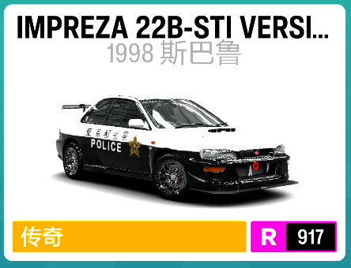
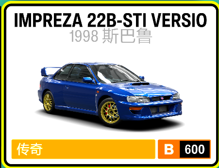
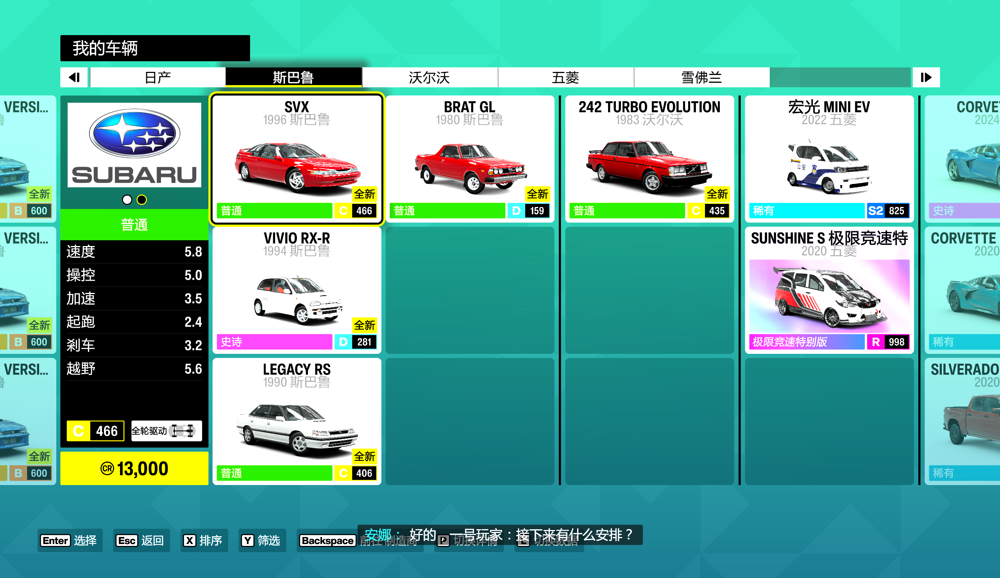
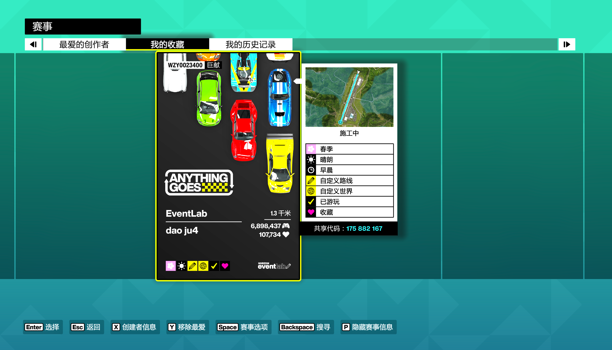
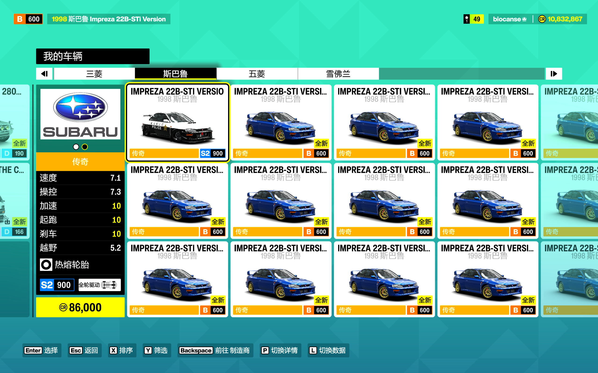

# 地平线6妙妙工具

这是一个《地平线6》自动化工具包。核心入口是 `FH6FullAuto.exe`，启动并完成首次设置后，可以自动刷技术点、自动给车辆点技术点、自动删除多余车辆、自动补买车辆；挂机运行即可持续获取超级抽奖。

`v1.2.6` 重点解决 OCR 准确率和建表偏移问题。接下来 2-3 天因为坐飞机等事情，无法及时更新；如果遇到问题，请先保留 `debug/` 和 `state/` 日志，后续集中处理。

## 下载后怎么用

1. 下载 Release 压缩包并解压。
2. 压缩包较大，推荐使用 [NanaZip](https://github.com/M2Team/NanaZip) 解压。
3. 按下面的“前置准备”设置好车辆、难度和当前页面。
4. 运行 `FH6FullAuto.exe`。
5. 首次运行按提示完成设置，最后按 `Enter` 确认开始。
6. 确认后程序会等待 10 秒，这段时间切回游戏窗口。等待结束时需要处于“大世界”可操作状态，参考下图。

启动时会让你选择全自动目标：

- 普通模式：按完整挂机流程运行，刷技术点到 `999`，目标车补到 `31` 辆。
- 快速验证模式：方便测试流程稳定性，只把技术点刷到达/超过 `100`。买车数量按预计刷完后的技术点整数除以 `32` 计算，例如当前 `7` 点会刷到 `107` 点，买车目标是 `107 / 32 = 3` 辆。


Release 会提供两个 OCR 版本：

- `PaddleOCR` 版：推荐优先使用。体积更大，内置 PaddleOCR PP-OCRv5 和便携 Python，识别能力更强。PaddleOCR 版还需要系统有 Microsoft Visual C++ 2015-2022 x64 运行库；缺少时启动自检会拦截自动化，按 Enter 会自动下载并安装，管理员权限由 Windows 弹窗请求。
- `MediaOCR` 版：备用版本，体积更小，使用 Windows 自带 `Media.Ocr`。主要给性能实在过差，或者 PaddleOCR 报错无法运行的电脑使用；它要求系统同时具备中文和英文 OCR 语言能力，缺少任意一个都会在启动自检时报错并写入日志，需要在 Windows 语言/可选功能里安装对应 OCR 语言包。

急停快捷键：

- `Space+C`：立即急停，直接退出当前脚本。
- `Space+V`：安全急停，正在跑子流程时会等当前轮收尾、复位后再退出。

如果游戏以管理员权限运行，本工具也需要右键“以管理员身份运行”，否则游戏可能收不到键鼠输入。

解压后，普通用户只需要看根目录：

- `FH6FullAuto.exe`：全自动主程序，主要入口。
- `AutoInputLoop.exe`：迎战巨汉 CR 挂机辅助。
- `EnterTapLoop.exe`：快速开启大量抽奖、超级抽奖。
- `README.pdf` / `README.md` / `使用说明.txt`：使用说明，优先看带图的 `README.pdf`。

`bin/`、`runtime/`、`config/`、`assets/` 是程序运行需要的内部文件夹，不要删除或移动。`debug/`、`state/` 会保存自动生成的日志、OCR 失败信息和虚拟列表状态；如果程序出问题，请保留这两个文件夹，方便排查。未处理异常会写入 `debug/last-error.txt`，当天完整错误追加日志在 `debug/error-log-YYYYMMDD.log`。PaddleOCR 版依赖自检结果会写入 `debug/ocr-dependency-check-last.txt`，MediaOCR 版依赖自检结果会写入 `debug/mediaocr-dependency-check-last.txt`。程序复用 UI 坐标缓存时会启动独立 OCR 保险进程校验当前页面；如果校验失败，主程序会自动退出并把现场写入 `debug/ui-cache-guard/` 和 `state/ui-cache-guard-*.result.txt`。

## 前置准备

### 1. 准备两辆 1998 斯巴鲁 Impreza 22B-STI Version

车库里需要有一辆用于刷蓝图的改装 `IMPREZA 22B-STI VERSION`，性能分必须是 `900`。推荐使用调教代码 `122 378 124`；也可以自己找能稳定跑到指定时间范围的调教，但不要盲目追求最快，太快会因为倍率到不了 `9` 导致少拿技术点，太慢也会错过脚本时序。程序会选择车辆列表排序最前的 `900` 分普通目标车，也就是状态 `2` 的指定车型。



还需要一辆原厂的 `IMPREZA 22B-STI VERSION`。开始运行全自动脚本前，当前驾驶车辆需要是这辆原厂车，改装后的那辆留在车库里。



车库里还需要至少有一辆“所属制造商排序在斯巴鲁后方”的任意车辆。脚本需要靠它确认列表已经滚出斯巴鲁制造商区域；如果斯巴鲁后面没有任何其它制造商车辆，程序可能无法判断斯巴鲁区域已经结束。

建议开始前先手动买几辆不同的斯巴鲁车辆，并且多买一些用于刷技术点的指定车型。滚出制造商边界这件事不读取游戏内存，只能依赖 OCR 和虚拟列表判断；斯巴鲁车辆太少时，横向滚动很容易直接碰到制造商边界，导致虚拟列表和实际选中位置错位。

如果你在斯巴鲁列表里看到类似下图这种情况：左边还是目标车/斯巴鲁，右边已经混入沃尔沃、五菱、雪佛兰等其它制造商，或者中间出现大片空格，说明车库里斯巴鲁车辆太少，脚本继续滚动时更容易错位。解决方式是先手动补一些斯巴鲁车辆，尤其是多买几辆用于刷技术点的 `IMPREZA 22B-STI VERSION`，再运行全自动脚本。



### 2. 设置游戏难度

进入难度设置：

- 开启自动转向。
- 使用自动挡。
- AI 难度最好选择“所向披靡”，避免赛事开始前弹出“是否增加难度”之类的询问，影响自动流程。
- 本工具支持任意分辨率。首次设置时会按你当前画面重新框选车辆格子；如果后续更改分辨率、窗口缩放或 UI 比例，需要用 `3` 重设设置重新框选。
- 建议把画质调到最低或较低，减少菜单动画和加载耗时，避免性能差的电脑超过脚本预留等待时间。
- 请预留足够的 CR。首次运行会要求输入当前 CR 点数；全自动流程买车每辆按 `86000 CR` 扣除，每次买车前都会检查余额。CR 不足时不会继续按购买键，会返回菜单并自动退出。

### 3. 收藏蓝图

蓝图代码 `890 169 683` 需要已经加入“我的收藏”，并且处于“我的收藏”的第一位。程序进入收藏蓝图列表后会直接选择第一项。



刷一次蓝图后，游戏结算会显示实际局内用时。这个实际局内用时必须大于 `24` 秒且小于 `28` 秒；太快会导致倍率不到 `9`，太慢会错过脚本时序。脚本会从按下 `Enter` 开始计时，等待 `40` 秒后按 `X`。

### 4. 首次运行设置

第一次运行或重设设置时，程序会让你做这些准备：

1. 进入下面这种“我的车辆”选车页面。
2. 填写当前屏幕能完整看到几列车、几行车。只算完整显示的车辆格子，不完整的不要算；左侧车辆详情栏、最左/最右边缘露出的半个格子都不要算。
3. 按提示用鼠标画框，精确框住“我的车辆”页面里所有完整可见车辆格子的整体区域。
   - 只框右侧车辆格子区域。
   - 不要框左侧车辆详情栏。
   - 不要框顶部制造商标签栏或底部按键提示。
   - 不要把边缘不完整的半格框进去。
4. 输入当前已有技术点数量。
5. 输入当前 CR 点数。这个值只在本次运行中使用，不写入永久配置。
6. 最后按 `Enter` 确认开始。确认前检查：
   - 当前驾驶车辆是原厂 `IMPREZA 22B-STI VERSION`。
   - 输入法已经切到英文，避免中文输入法卡住按键。
   - 游戏窗口已准备好接收输入。



确认开始后，程序会等待 10 秒才真正执行。

该脚本会按首次框选和 OCR 动态识别车辆列表，车库里有其它车辆或干扰车辆不会影响流程；只需要保证上面的车辆、难度、收藏蓝图和起始状态这些前提条件满足。

## 全自动流程会做什么

`FH6FullAuto.exe` 会循环执行：

1. 从大世界进入车库标准位。
2. 自动进入斯巴鲁车辆列表。
3. 识别 `IMPREZA 22B-STI` 和 `全新` 标记，自动给目标车点技术点。
4. 自动删除已点完且可删的多余车辆。
5. 找到车辆列表排序最前的 `900` 分指定车型，用它进入刷技术点蓝图。
6. 按当前车库情况自动补买目标车。
7. 自动运行刷技术点蓝图；普通模式把技术点补到 `999`，快速验证模式只补到达/超过 `100`。
8. 返回车库，继续下一轮。

正常情况下，开始后挂机即可。屏幕左上角浮层会显示当前大阶段、当前操作、下一步/动作串、主循环轮次、技术点、本次主程序运行期间已获得的超级抽奖数量、刷点进度、总耗时和失败数。

## 仍然保留的独立小工具

下面两个小工具没有被全自动流程完全覆盖，所以继续保留：

### AutoInputLoop.exe

用于“迎战巨汉”挂机刷 CR 的挂机保持脚本。进入地图后启动即可。

注意：它不是靠脚本刷 CR，主要还是依赖游戏内的安娜自动驾驶路线；脚本只是定时发送少量输入，避免挂机过程中卡住。

### EnterTapLoop.exe

用于自动开启大量抽奖、超级抽奖。

启动后等待 10 秒，然后不断执行：

```text
把鼠标移到屏幕右上角
Enter 按下 0.1 秒
等待 0.1 秒
```

## 不建议手动打开的内部组件

`MinuteWLoop.exe`、`SpaceDownEnterLoop.exe`、`FH6SkillPointOcr.exe`、`FH6VehicleDeleteOcr.exe` 等现在主要作为 `FH6FullAuto.exe` 的内部子流程使用。普通用户直接运行 `FH6FullAuto.exe` 即可。

## 鸣谢

PaddleOCR 版使用 [PaddleOCR](https://github.com/PaddlePaddle/PaddleOCR) 的 PP-OCRv5 server 模型。感谢 PaddleOCR 项目提供高质量的中文、英文文字识别能力。

MediaOCR 版使用 Windows 自带的 `Windows.Media.Ocr` 能力，不额外内置第三方 OCR 模型。

## 重新编译

源码和构建脚本已经保留在仓库中：

- `src-cs/`：全自动主程序、点技术点、删车、买车前置调试等核心 C# 源码。
- `shared-cs/`：多个程序共用的常量和输入规则。
- `legacy-scripts/src/`：仍会被总构建脚本引用的旧小工具源码。
- `docs/`：当前流程、虚拟表、重构记录和实现说明。
- `config/default.json`：默认配置模板。
- `runtime/*.py` / `runtime/*.ps1`：OCR 桥接脚本；PaddleOCR 运行依赖和模型不会提交到仓库，发布包或本地环境中准备。

需要重新编译时，在仓库根目录运行：

```bat
build_cs.cmd
```
